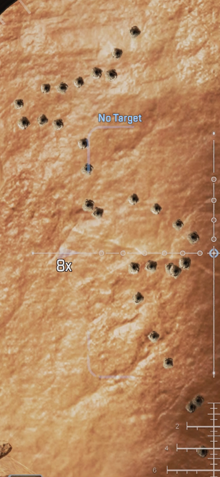

# How to capture recoils

1. (one time) install (python 3)[https://www.python.org/downloads/], [pipenv](https://pipenv.pypa.io/en/latest/). Run `pipenv install` in ./processing dir.

    You will also need to record in-game footage - NVIDIA overlay or [OBS](https://obsproject.com/) worked fine for me.

    Update Apex Legends starup options to include `+cl_showpos 1`.

2. Go to fire range and take a weapon with maximum mag and a sniper rifle with x4-8. Start recoding, fire the whole magazine then point to the most distant points through sniper scope, capture the whole pattern too. For example:

    

    <iframe width="560" height="315" src="https://www.youtube.com/embed/f52L6WkNIS0" title="YouTube video player" frameborder="0" allow="accelerometer; autoplay; clipboard-write; encrypted-media; gyroscope; picture-in-picture" allowfullscreen></iframe>

    It's important not to move mouse while shooting. One can either lift a mouse from a pad or map mouse buttons to keyboard if possible.

    Save pattern image and cut it:

    

3. Open ./processing/recoils.ipynb jupyter lab and enter angle coordinates of two distant points in `np.round(points(...), 2)` cell. That will give you a distance in pixels between points.

    Open https://apexlegendsrecoils.net/editor, load an image of the pattern, enter name of the weapon (see ./client/specs.json for possible values). Use left mouse click to add and move individual points, right button to remove them and middle button to mark "anchors". There should be exatly two anchors at marks that we just measured. "auto targets" might also be useful as it converts detected areas to marks - play with settings to understand how it works.

    Copy resulting json string back to jupyter notebook. Running next cell will produce arrays for X and Y coordinates that now can be put into ./client/specs.json or somewhere else.

    <iframe width="560" height="315" src="https://www.youtube.com/embed/tvXYcHC7TbU" title="YouTube video player" frameborder="0" allow="accelerometer; autoplay; clipboard-write; encrypted-media; gyroscope; picture-in-picture" allowfullscreen></iframe>

    As there is some randomness of the pattern - repeat 2-4 steps a few times - there is a "error estimation" cell that might help to understand if results have converged enough.

